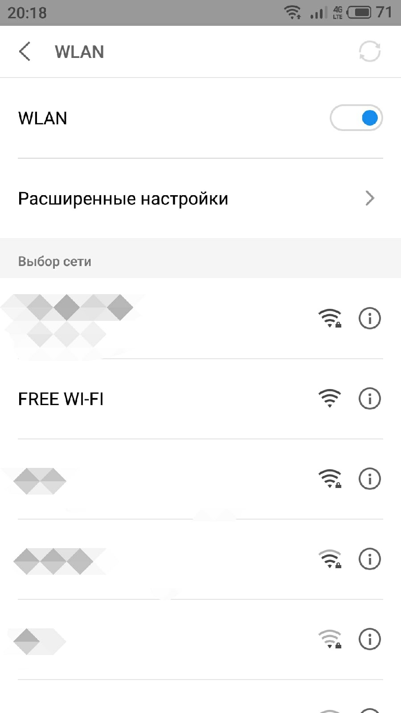
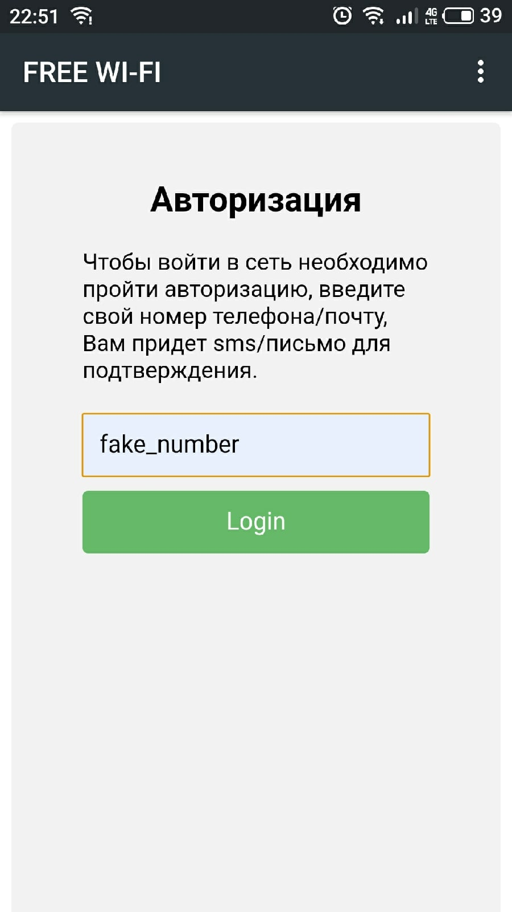
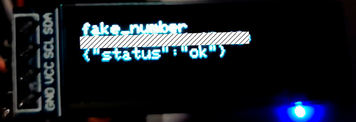
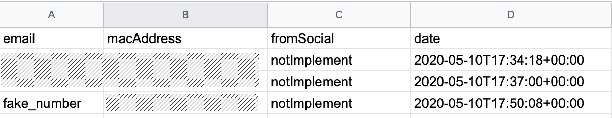

# esp8266-captive-portal
Simple captive portal with NodeMcu, Oled. Save data to Google Spreadsheet with Node.js & Heroku.

## You need
1. NodeMcu V3 Lua Wi-Fi
2. OLED I2C display 0.91 (128x32px)
3. Usb micro cable
4. Soldering iron
5. PC

## Preview
1. Choose network

2. After click on network, we go to html page

3. Led display, after click "Login"  

4. Google sheet, after click "Login"

